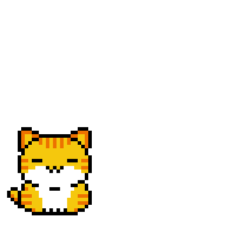

<h1 align="center">👋 ¡Hola! Soy SebasDev</h1>

  

---

## 🎓 Sobre mí

- 📚 Estudiante de **Tecnología en Sistemas** (6° semestre)  
- 💻 Apasionado por el desarrollo de software y el aprendizaje constante  
- 🚀 Enfocado en mejorar habilidades en **Java**, **estructuras de datos**, **redes** y **bases de datos**

---

## 🧠 Tecnologías y herramientas

  
  
  
  
  
  
  
  

---

## 📊 GitHub Stats

  
  

<!--
🛑 DESCOMENTA ESTA SECCIÓN CUANDO TENGAS REPOS CON CÓDIGO PÚBLICO 🛠️

  

-->

---

## 📈 Actividad reciente

  

---

## 📫 ¡Conectemos!

  
  
  

---

> 🧩 _"Siempre aprendiendo, siempre construyendo."_

